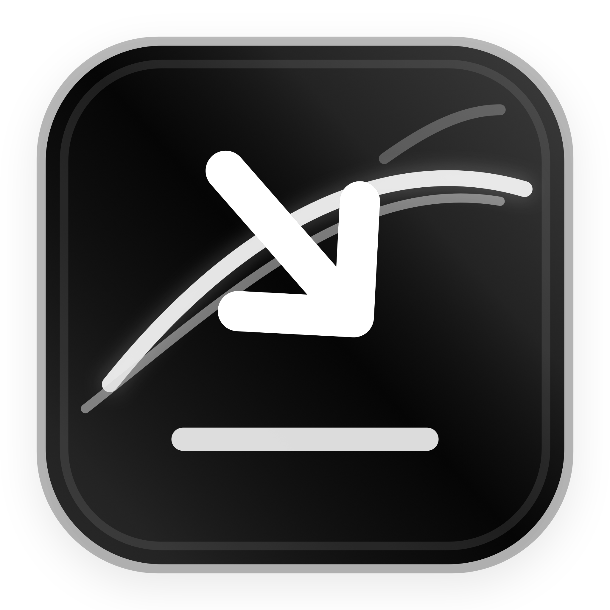

<p align="center">
  
</p>

<h1 align="center">Downlink</h1>

<p align="center">
  Download videos and audio from supported links with predictable filenames.
</p>

<p align="center">
  <a href="https://github.com/wittysworkspace/Downlink/releases/latest"><strong>Download Downlink</strong></a>
  ·
  <a href="https://github.com/wittysworkspace/Downlink/releases">Releases</a>
  ·
  <a href="LICENSE">MIT License</a>
</p>

Downlink is a lightweight macOS downloader built with SwiftUI. Paste a supported link, choose a format and quality, then save video or audio with a clean filename. It uses `yt-dlp` for link support and `ffmpeg` for merging, remuxing, and audio conversion.

## Download

Download the latest DMG from the release page:

[Download Downlink for macOS](https://github.com/wittysworkspace/Downlink/releases/latest)

The packaged release includes standalone `yt-dlp` and `ffmpeg`, so normal users do not need Homebrew or any command-line setup.

## Features

- Native macOS interface designed for quick everyday use
- Paste one or more links and automatically check whether they are available
- See an estimated file size before downloading when the source provides one
- Download video or extract audio
- Video formats: MP4, MKV, WEBM, MOV
- Audio formats: MP3, M4A, WAV, FLAC, OPUS, AAC
- Quality presets: 4K, 1440p, 1080p, 720p, 480p
- Clean output names using the original title plus selected quality, like `Original title [1080p].mp4`
- Optional subtitles, metadata, and artwork
- English, Simplified Chinese, Traditional Chinese, and Thai interface languages

## Requirements

- macOS 14 or newer
- Apple Silicon Mac for the current packaged build

The source code is public and released under the MIT License.

## Install

1. Download `Downlink.dmg` from [Releases](https://github.com/wittysworkspace/Downlink/releases/latest).
2. Open the DMG.
3. Drag `Downlink.app` into `Applications`.
4. Open Downlink.

If macOS blocks the app because it was downloaded from the internet, right-click `Downlink.app`, choose `Open`, then confirm. A fully notarized release requires an Apple Developer account.

## Development

Build and run from source:

```sh
swift run
```

Build the distributable app:

```sh
./scripts/generate_icon.swift
./scripts/build_app.sh
```

The build script copies optional bundled tools from:

```text
Vendor/bin/yt-dlp
Vendor/bin/ffmpeg
```

into:

```text
Downlink.app/Contents/Resources/bin/
```

For a portable release, use standalone/static `yt-dlp` and `ffmpeg` binaries and test the packaged app on a clean Mac.

## Legal

Only download media that you created, own, licensed, or otherwise have permission to save. Downlink does not bypass DRM, paywalls, private access, or platform restrictions. Site extractors can change over time, and some content may be unavailable because it is private, protected, region-limited, or DRM-restricted.

## License

Downlink is released under the [MIT License](LICENSE). See [Third-Party Notices](THIRD_PARTY_NOTICES.md) for bundled tool licenses.
